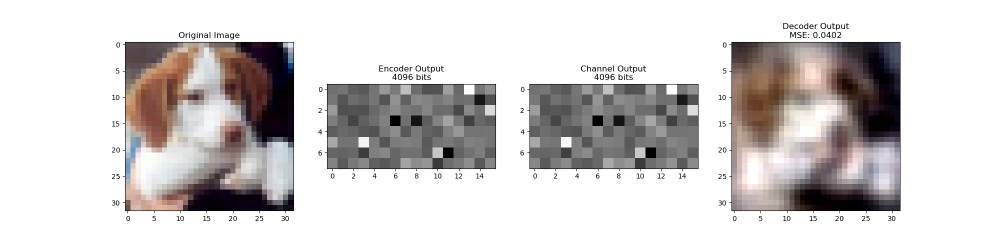
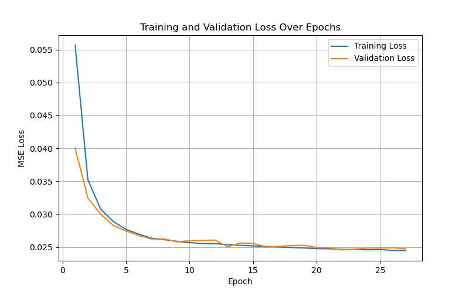
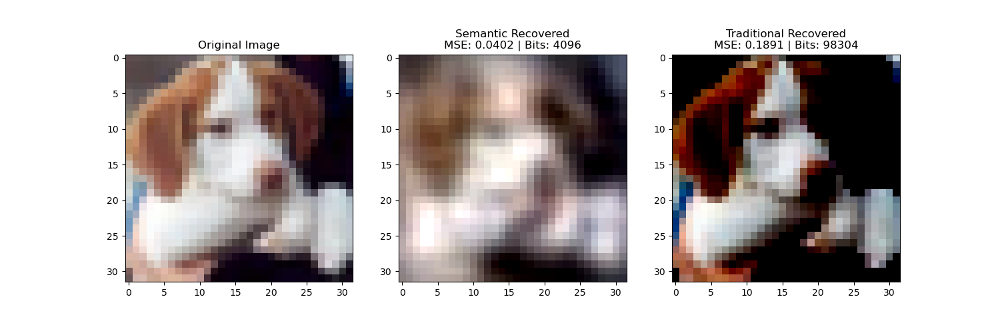

# semancomm-sbox

Welcome to **semancomm-sbox**! 🚀

This is my personal playground for experimenting with **Semantic Communications**. This repository serves as a sandbox where I explore different concepts, models, and strategies for optimizing and understanding communication at the semantic level. 

> **Disclaimer:** This is purely experimental. Please do not judge, do not conclude. However, any suggestions are always welcome!

## 🌌 **What is Semantic Communication?**
Semantic Communication goes beyond traditional bit-level communication by focusing on the meaning of the transmitted information. It aims to improve communication efficiency by understanding and transmitting only the relevant semantic information required for the intended task.

## 🔄 **Semantic Communication Process (Step-by-Step)**
This step-by-step visualization illustrates the flow of information through the semantic communication pipeline:

- **Original Image**: The raw input from the CIFAR dataset.
- **Encoder Output**: The compressed semantic representation after encoding.
- **Channel Output**: The representation after passing through the noise channel.
- **Decoder Output**: The final output after semantic decoding.

This visualization showcases the transformation of information through the semantic encoder, noisy channel, and the decoder.

---

## 🔥 **Current Experiments**
- [ ] Semantic-aware text generation
- [ ] Contextual information extraction
- [ ] Knowledge-augmented communication models
- [ ] Fine-tuning LLaMA for semantic representation

---

## 🤝 **Contributing**
Feel free to fork this repository and experiment! Open issues if you find any bugs or have interesting ideas to try out.

---

**Let's redefine communication together.**

---

📝 **Any suggestions? I'm all ears.**

---

_Just experimenting. Let's see where it goes._

---

## 📈 **Training and Validation Loss**
Below is the training and validation loss curve observed during model training:

This plot represents the MSE loss over epochs for both the training set and validation set, showcasing the learning progression and convergence of the model.

---

## ⚖️ **Comparison with Traditional Communication**
This comparison highlights the difference in MSE and the number of bits transmitted:

- **Original Image**: The reference image.
- **Semantic Recovered**: The image recovered through semantic communication.
- **Traditional Recovered**: The image recovered through traditional communication.
- The MSE and the number of bits transmitted are displayed in the titles for quantitative analysis.

---